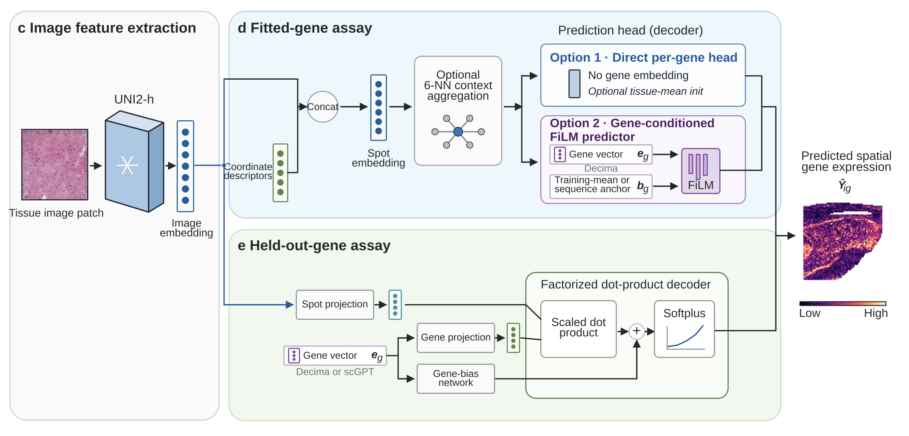

# SpatioS2E

Research software for component-resolved evaluation and gene-conditioned
prediction in virtual spatial transcriptomics.

[](https://github.com/tjchen020524/SpatioS2E/actions/workflows/tests.yml)
[](pyproject.toml)
[](LICENSE)

SpatioS2E separates agreement in mean expression across genes from recovery of
within-gene spatial variation. The package provides model-agnostic evaluation,
matched gene-vector controls, trainable fitted-target and target-disjoint
decoders, and the frozen design records used in the accompanying study.



*Image feature extraction and the separately trained fitted- and held-out-gene
assays used in the accompanying study (Fig. 1c–e).*

## Highlights

- Decompose `[spot, gene]` expression matrices into gene means and centred
  within-gene variation.
- Report full-matrix, gene-mean, gene-wise and centred PCC and error endpoints,
  including the exact MSE decomposition.
- Centre observed and predicted expression independently within tissue section.
- Train shared decoders while excluding held-out targets from optimization and
  checkpoint selection.
- Construct dimension-matched random, constant and partition-preserving
  identity-shuffled gene-vector controls.
- Fit a no-image ridge counterfactual that predicts one mean per held-out gene.
- Reuse the manuscript's biological splits, target partitions, model settings
  and external-model checksums.

The source distribution also includes the [external GeneQuery and DeepSpot-M
audit workflows](experiments/external_genequery_component_audit/README.md) used
in Fig. 5c and Extended Data Fig. 10. These require separately obtained cohort
inputs and upstream model artifacts.

## Installation

SpatioS2E requires Python 3.10 or newer.

```bash
git clone https://github.com/tjchen020524/SpatioS2E.git
cd SpatioS2E
python -m venv .venv
source .venv/bin/activate
python -m pip install -e .
```

Install preprocessing and development dependencies when needed:

```bash
python -m pip install -e ".[preprocess,dev]"
```

The publication release also includes a fully pinned CPython 3.10 Linux/CPU
environment and an independently generated validation record. See
[`validation/README.md`](validation/README.md) for the exact clean-room
procedure.

## Component-resolved evaluation

Use the Python API with any aligned observed and predicted matrices:

```python
import numpy as np

from spatios2e.evaluation import component_metrics

observed = np.load("observed.npy")
predicted = np.load("predicted.npy")
metrics = component_metrics(observed, predicted)

print(metrics["full_matrix_pcc"])
print(metrics["gene_mean_pcc"])
print(metrics["mean_gene_pcc"])
print(metrics["centered_rmse"])
print(metrics["decomposition_error"])
```

For finite rectangular matrices, the evaluator verifies

```text
full-matrix MSE = gene-mean MSE + centred MSE.
```

The equivalent command-line interface reads an NPZ containing `observed` and
`predicted` arrays:

```bash
spatios2e-eval-components predictions.npz \
  --output component_metrics.json
```

To remove observed and predicted means independently within each section, add
section labels to the NPZ and pass `--section-key section_ids`.

## Gene-conditioned prediction

### Target-disjoint decoders

`spatios2e.models` provides the primary `FactorizedDotProductDecoder` and three
architecture controls:

- `BiasFreeFactorizedDecoder`;
- `ConcatenationMLPDecoder`;
- `SectionCenteredResidualDecoder`.

`spatios2e.training.heldout` exposes reusable fitting, checkpoint selection and
evaluation functions for precomputed spot representations and fixed gene
vectors. The held-out targets enter only the post-fit evaluation call. See the
[`held-out assay contract`](docs/heldout_assay.md) for the batch interface and
an API example.

The manuscript uses sequence-derived Decima vectors and static scGPT gene-token
vectors. Utilities for vector standardization and matched controls are in
`spatios2e.models.gene_vectors`. Static scGPT token vectors can be extracted
from an upstream checkpoint with:

```bash
spatios2e-extract-scgpt-tokens \
  --checkpoint weights/scgpt/whole_human_model/best_model.pt \
  --vocabulary weights/scgpt/whole_human_model/vocab.json \
  --output data/scgpt_whole_human_gene_tokens.npz
```

The no-image counterfactual is available as both a Python API and a CLI:

```bash
spatios2e-gene-mean-counterfactual gene_vectors_and_training_means.npz \
  --output heldout_gene_means.npz
```

### Fitted-target workflow

The fitted-target implementation combines frozen tissue-image features,
spatial coordinates, optional neighbourhood context and optional gene
conditioning. A donor-disjoint hippocampus configuration is supplied under
`configs/` and `examples/`:

```bash
bash examples/hippocampus/run_train_eval.sh
```

The underlying steps can also be invoked directly:

```bash
spatios2e-compute-residual-scale configs/hippocampus_spatios2e.yaml
spatios2e-train --config configs/hippocampus_spatios2e.yaml
spatios2e-eval \
  --config configs/hippocampus_spatios2e.yaml \
  --ckpt outputs/hippocampus_spatios2e/checkpoints/best.pt \
  --split test \
  --save-dir outputs/hippocampus_spatios2e/results
```

New-cohort prediction requires cohort data and upstream tissue-image and gene
representations. UNI2-h, Decima and scGPT weights are obtained from their
respective projects; trained downstream checkpoints are not distributed in
this repository.

## Manuscript resources

The [reproduction guide](docs/reproduction.md) provides executable UNI2-h and
Decima preparation, an input schema, a complete primary run path and the
[archived custom analyses](manuscript_workflows/README.md). Decima-conditioned
fitting additionally requires `decima==0.5.1`; weights alone do not install it.

[`configs/manuscript/`](configs/manuscript/README.md) contains the exact
four-cohort biological splits, primary and sensitivity target partitions,
held-out-assay settings and external-model provenance. The
[`manuscript-to-code map`](docs/paper_code_map.md) links each analysis to its
public implementation.

The repository includes source code, configuration records and tests. Numerical
Source Data accompany the manuscript submission; a public deposit link awaits
author approval. Raw data, licensed third-party weights, trained checkpoints
and dense predictions are not included here. Version 1.1.0 identifies this
candidate, not a new public release or DOI.

## Repository layout

- `spatios2e/evaluation/` — component-resolved metrics and counterfactuals;
- `spatios2e/models/` — fitted-target models and target-disjoint decoders;
- `spatios2e/training/` — fitted-target and held-out-target training;
- `spatios2e/preprocessing/` — expression, image-feature and graph preparation;
- `configs/manuscript/` — frozen manuscript design records;
- `examples/hippocampus/` — fitted-target example;
- `tests/` — unit, decoder, split and synthetic-training tests;
- `validation/` — dependency and clean-room validation records.

## License and citation

SpatioS2E is released under the [MIT License](LICENSE). Citation metadata are
provided in [`CITATION.cff`](CITATION.cff). The version-specific Zenodo DOI and
manuscript DOI will be added after assignment.
